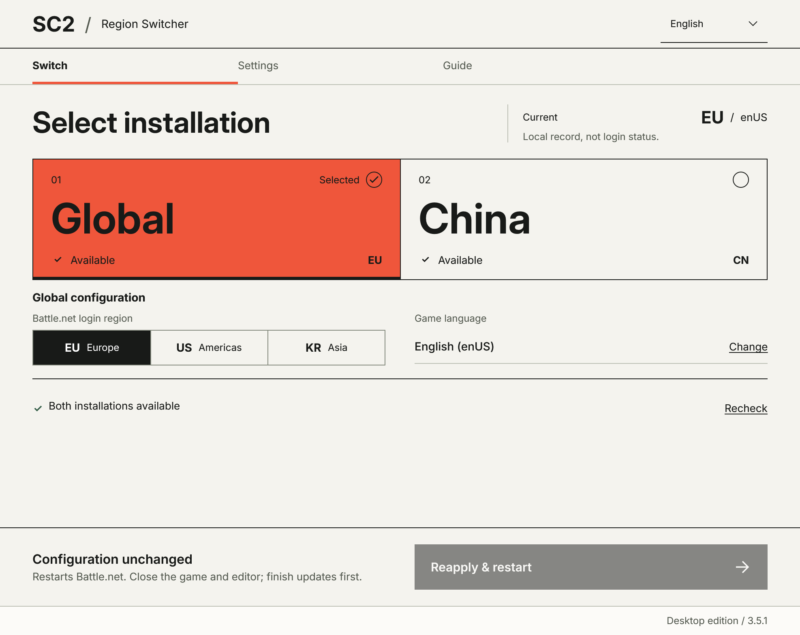

[English](README.md) · [简体中文](README.zh-CN.md) · [Français](README.fr-FR.md) · [Deutsch](README.de-DE.md) · [Nederlands](README.nl-NL.md)

# SC2 Region Switcher

**Downloads:** [v3.5.3-preview.1](https://github.com/JiayanJohnnyChu/SC2RegionSwitcher/releases/tag/v3.5.3-preview.1) · [Alle Versionen](https://github.com/JiayanJohnnyChu/SC2RegionSwitcher/releases)

SC2 Region Switcher ermöglicht die Nutzung getrennter China- und internationaler Installationen von StarCraft II mit einer Battle.net-Anwendung. Das Programm wechselt die Battle.net-Anmelderegion und die gemeinsam genutzten Spracheinstellungen des Spiels.

Die Anwendung unterstützt elf Oberflächensprachen und die Auswahl einer installierten internationalen Spielsprache.

## Installation

Erforderlich sind Windows x64 und **[Microsoft .NET 10 Desktop Runtime x64](https://dotnet.microsoft.com/en-us/download/dotnet/10.0)**. Zum Spielen ist das SDK nicht nötig. Die verfügbaren Pakete sind nicht signiert.

| Paket | Verwendung |
| --- | --- |
| MSI | Installation für alle Windows-Benutzer mit Administratorzustimmung, Startmenüeintrag und regulärer Windows-Deinstallation. Die Anwendung selbst läuft mit normalen Benutzerrechten. |
| Portables ZIP | Vollständiges Entpacken in ein separates Verzeichnis, wobei alle enthaltenen Dateien zusammenbleiben. `SC2Switcher.Wpf.exe` startet die Anwendung; Verknüpfung und Deinstallationseintrag werden nicht angelegt. |

Die „Source code“-Downloads von GitHub sind keine direkt ausführbaren Anwendungspakete.

## Erste Konfiguration

1. Beide Spielinstallationen sind in Battle.net vollständig installiert und verwenden getrennte Verzeichnisse, etwa `D:\Games\StarCraft II CN` und `D:\Games\StarCraft II Global`. China benötigt Texte und Sprachausgabe in vereinfachtem Chinesisch; die internationale Installation benötigt beide Ressourcen in der gewählten Sprache.
2. Der endgültige Installationspfad wird vor der Installation in Battle.net geprüft, auch wenn **Installieren** angezeigt wird. Battle.net kann einen Unterordner `StarCraft II` ergänzen oder die andere Installation erkennen.
3. Die Einstellungen enthalten das Battle.net-Verzeichnis, beide Spielverzeichnisse und die tatsächlich verwendete Datei `StarCraft II\Variables.txt` im Dokumente-Ordner des Spiels. Ein normaler Spielstart mit anschließendem regulärem Beenden erzeugt die Datei, falls sie fehlt.
4. **Speichern und prüfen** prüft und speichert die Pfade, ohne die Spielsprache zu ändern. Vorbereitung und Pfadbeispiele stehen in der englischen [Nutzungsanleitung](docs/SETUP.md).

## Regionswechsel und Sprache

Vor dem Wechsel müssen StarCraft II und der Editor geschlossen sowie Battle.net-Downloads, Aktualisierungen und Reparaturen abgeschlossen sein. Das Ziel ist China oder International; für International stehen zusätzlich die Anmelderegionen EU, US und KR zur Auswahl. Das Programm beendet Battle.net regulär, sichert und ändert die Spracheinstellungen und öffnet die gewünschte Anmelderegion. Die Bedienelemente bleiben bis zum Abschluss gesperrt.

Kontoanmeldung, Spielserverauswahl und Spielstart erfolgen in Battle.net. **EU, US und KR sind Battle.net-Anmelderegionen und bestätigen nicht den ausgewählten Spielserver.** Die Oberflächensprache ist von der Spielsprache unabhängig. Die Anwendung übernimmt die gespeicherte internationale Spielsprache beim nächsten Wechsel; Texte und Sprachausgabe müssen bereits über Battle.net installiert sein.

## Spielstände, Sicherungen und Updates

Das Programm ändert in den gemeinsamen Spieleinstellungen nur die Spracheinträge. Es kopiert, löscht oder verwaltet weder Kampagnenspielstände noch Replays oder `Accounts`-Dateien. Spielkonten und Regionen bestimmen den Zugriff auf den Fortschritt; das Programm bietet keine Synchronisierung von Cloud-Spielständen.

Die Programmeinstellungen und Sicherungen liegen unter `%LOCALAPPDATA%\SC2RegionSwitcherV2` und bleiben nach der Deinstallation erhalten. Eine ausstehende Wiederherstellung benötigt die ursprüngliche Konfiguration und Sicherungen. Ein MSI-Update verwendet bei geschlossener Anwendung einen neueren Installer; ein portables Update verwendet ein neues Verzeichnis und eine angepasste Verknüpfung. Beide Verfahren lassen die Spielinstallationen an ihrem bisherigen Ort.

## Häufige Fragen

| Frage | Antwort |
| --- | --- |
| Die Anwendung startet nicht | Desktop Runtime 10 x64 und alle mitgelieferten Anwendungsdateien sind erforderlich. |
| Ein Spielverzeichnis oder eine Sprache ist nicht verfügbar | Das Verzeichnis muss das Spielhauptverzeichnis sein; Installation, Texte und Sprachausgabe müssen vollständig sein. |
| Der Wechsel schlägt fehl oder eine Wiederherstellung steht aus | Die Fehlerdetails nennen den nächsten Prüfschritt. Die ursprünglichen Einstellungen und Sicherungen bleiben erforderlich; die Anleitung beschreibt die Wiederherstellung. |

Die ausführliche Dokumentation ist auf Englisch und in vereinfachtem Chinesisch verfügbar; die folgenden Links führen zu den englischen Fassungen.

| Weitere Informationen | Links |
| --- | --- |
| Anleitung für Spieler | [Nutzung und Fehlerbehebung](docs/SETUP.md) |
| Versionen und Entwicklung | [Änderungsprotokoll](CHANGELOG.md), [Entwicklung](docs/DEVELOPMENT.md), [Validierung](docs/VALIDATION.md) |

Die ursprünglichen Projektmaterialien verwenden die [MIT-Lizenz](LICENSE); die [Drittanbieterhinweise](THIRD-PARTY-NOTICES.md) beschreiben enthaltene Schriften und weitere lizenzierte Materialien.
